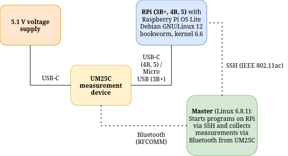

# About
Experiments for measuring the energy consumption of a Raspberry Pi (RPi) device.

# Experiments
- The `experiments` folder contains the code for all of the experiments. There are also  R scripts for analysis and generating plots from the data. Each experiment directory has a readme file with more information about the experiment.
- Most of the experiments assume that there is an SSH key generated such that the user does not have to keep typing their password if SSH usage is required for running commands on the RPi during the experiment.

## RPi operating system used during testing
The [Raspberry Pi OS Lite 64-bit version](https://www.raspberrypi.com/software/operating-systems/) was utilized during the experiments. The recommended way to install it is to use the [Raspberry Pi imager](https://www.raspberrypi.com/software/) tool.

## Generating an SSH key
An easy way to generate an SSH key goes as follows:
- On the machine that communicates with the RPi run: `ssh-keygen`
- Copy the public key to the RPi: `ssh-copy-id -i ~/.ssh/<filename>.pub username@raspberrypihostname` (if the [Raspberry Pi imager](https://www.raspberrypi.com/software/) tool was used to write the operating system, the hostname is likely set to `raspberrypi.local`)

# measurement.py
- Reads measurement values (current, voltage, power, accumulated energy) from a RuiDeng UM25C measurement device and writes them to stdout in CSV format with timestamps.
- Used in every experiment.

To run the program and redirect the output to a file:
```
python measurement.py a l t e > out.csv
```
where:
- `a` = The bluetooth address of your UM25C device. The address can be found with bluetoothctl, for example.
- `l` = Measurement time in seconds. 
- `t` = Wait time target between polling in seconds (time between measurements can vary due to delays/errors in responses from the meter)
- `e` = "y" or "n". If `e` = "y", exactly `ceil(l/t)` measurements will be collected. If `e` = "n", the measurement process will be stopped when `l` seconds have passed even if less than `ceil(l/t)` measurements have been collected.

With ctrl + C the measurement program can be stopped without issue before the time is up.

# A schema of the measurement setup used
The setup that the experiments are created around is presented in the following picture:

